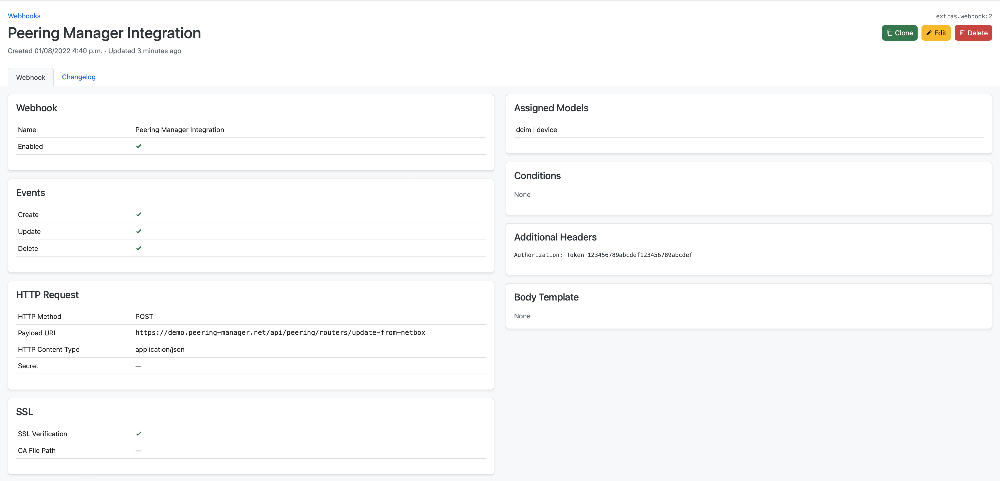

# Third-Party Integration

## PeeringDB

Some Peering Manager's features can be unlocked if, and only if, a PeeringDB
cache has been created locally. These features include, discovery of existing
IXP connections, discovery of common IXP between networks, discovery of
potential peering partners at IXPs.

Fetching PeeringDB data and storing them locally, can be achieved in two ways:

1. Using a cron based task, to keep the cache always up-to-date, see
   [caching in the local database](setup/8-scheduled-tasks.md)
2. Using the web interface (requires admin permissions). Click on
   `Cache Management` in the top right user menu.

Some data in PeeringDB are protected and need authentication to get access to
them. To do so, a configuration setting named `PEERINGDB_API_KEY` can be used.
An API key can be generated on the PeeringDB website in your account details.

Note that if you've setup authentication after doing your first PeeringDB
synchronisation, you will have to flush existing data and perform a new
synchronisation to get all data back.

## NetBox

Peering Manager has a little integration with NetBox to improve workflows
regarding devices (routers). In most cases, users of NetBox will prefer to
avoid duplicating data from NetBox. For this particular reason, two approaches
are proposed to users.

1. When creating or deleting a router, and when using `NETBOX_API`,
   `NETBOX_API_TOKEN` with a valid values, Peering Manager will propose to the
   user to select NetBox device from a dropdown list. This only create a link
   between the two sources of truth in a very basic way.
2. Another more advanced integration, that can only works if the first one is
   also active, is to point a NetBox webhook on one of Peering Manager's API
   endpoint. In this way, Peering Manager will be able to create/update/delete
   devices based on what NetBox will send. An example of NetBox' webhook is
   displayed below. The webhook method must be `POST`, the URL must point to
   `/api/peering/routers/update-from-netbox/` and additional headers must
   contain the authentication header like `Authorization: Token <the token>`.



Example of required minimal data for the webhook integration to work (other
data won't be used, if included):

```json
{
    "event": "deleted",
    "data": {
        "id": 1,
        "display": "etz-router01.as201281.net",
        "name": "etz-router01.as201281.net",
        "device_role": {
            "id": 7,
            "url": "/api/dcim/device-roles/7/",
            "display": "Router",
            "name": "Router",
            "slug": "router"
        },
        "platform": {
            "id": 3,
            "url": "/api/dcim/platforms/3/",
            "display": "Juniper Junos",
            "name": "Juniper Junos",
            "slug": "juniper-junos"
        },
        "status": {
            "value": "active",
            "label": "Active"
        },
        "local_context_data": null
    }
}
```

Note that these integrations haven't been tested with Nautobot.

## IX-API

Coupled with IX-API, Peering Manager can display useful information about your
connections to an IXP such as services provided by the IXP (route servers),
what an IXP knows about your services (such as service IDs) and connections to
the IXP that you already have setup or not. It provides a way to quickly
import a connection found in IX-API to Peering Manager.

An IX-API instance can be linked to one or more IXPs inside Peering Manager.
To do so, an [IX-API object](models/extras/ixapi.md) must be created inside
the `3rd Party > IX-API` section found on the left side bar. You'll have to
provide the URL, key and secret as well as an identity (once URL, key and
secret are valid) that corresponds to the entity you are representing (e.g.
your company). Once done, you'll have to edit the IXP that you want to use
IX-API with and select the newly created IX-API object from the
`IX-API endpoint` dropdown list. After saving, an `IX-API` tab will appear on
the IXP view.
